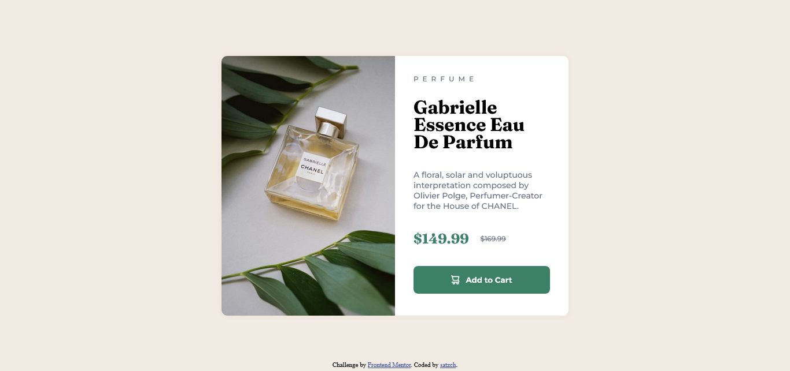

# Frontend Mentor - Product preview card component solution

This is a solution to the [Product preview card component challenge on Frontend Mentor](https://www.frontendmentor.io/challenges/product-preview-card-component-GO7UmttRfa).

Frontend Mentor challenges help you improve your coding skills by building realistic projects. 

## Table of contents

- [Overview](#overview)
  - [The challenge](#the-challenge)
  - [Screenshot](#screenshot)
  - [Links](#links)
- [My process](#my-process)
  - [Built with](#built-with)
  - [What I learned](#what-i-learned)
- [Author](#author)


## Overview

### The challenge

Users should be able to:

- View the optimal layout depending on their device's screen size
- See hover and focus states for interactive elements

### Screenshot (Desktop)




### Screenshot (Mobile)


### Links

- Solution URL: [https://github.com/satzch/product-preview-card-front-end-mentor-project](https://github.com/satzch/product-preview-card-front-end-mentor-project)
- Live Site URL: [https://satzch.github.io/product-preview-card-front-end-mentor-project](https://satzch.github.io/product-preview-card-front-end-mentor-project)

## My process

### Built with

- HTML5
- Flexbox
- CSS Grid


### What I learned


```css
.product-img{
        content: url("../images/image-product-mobile.jpg");
}
```


## Author

- Frontend Mentor - [@satzch](https://www.frontendmentor.io/profile/satzch)